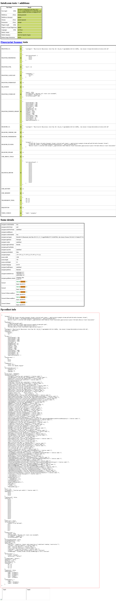
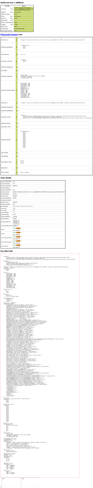

# 🥷🏻 tf-playwright-stealth [](https://pypi.org/project/tf-playwright-stealth/) [](https://agentql.com) [](https://discord.gg/agentql)


> Transplanted from [puppeteer-extra-plugin-stealth](https://github.com/berstend/puppeteer-extra/tree/master/packages/puppeteer-extra-plugin-stealth).

This is a package that makes playwright stealthy like a ninja by spoofing browser features in order to reduce the chance of detection.

## Install

```
pip install tf-playwright-stealth
```

## Usage

### sync
```python
from playwright.sync_api import sync_playwright
from playwright_stealth import stealth_sync

with sync_playwright() as p:
    browser = p.chromium.launch(
            headless=True,
        )
    page = browser.new_page()
    stealth_sync(page)
    page.goto("https://bot.sannysoft.com/")
    page.screenshot(path=f"example_with_stealth.png", full_page=True)
    browser.close()
```


### async

```python
from playwright.async_api import async_playwright
from playwright_stealth import stealth_async

with async_playwright() as p:
    browser = await p.chromium.launch(
            headless=True,
        )
    page = await browser.new_page()
    await stealth_async(page)
    await page.goto("https://bot.sannysoft.com/")
    await page.screenshot(path=f"example_with_stealth_async.png", full_page=True)
    await browser.close()
```
## Results
From [bot.sannysoft.com](https://bot.sannysoft.com/)
| Headless | Headful |
|----------|---------|
|  |  |
